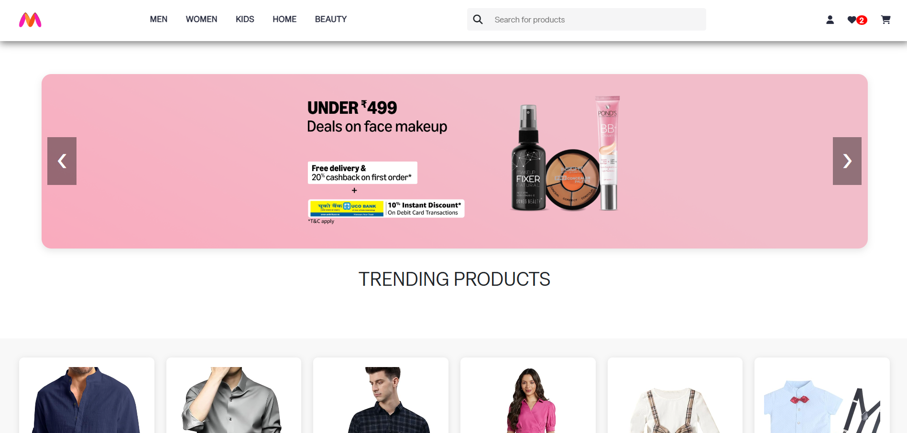
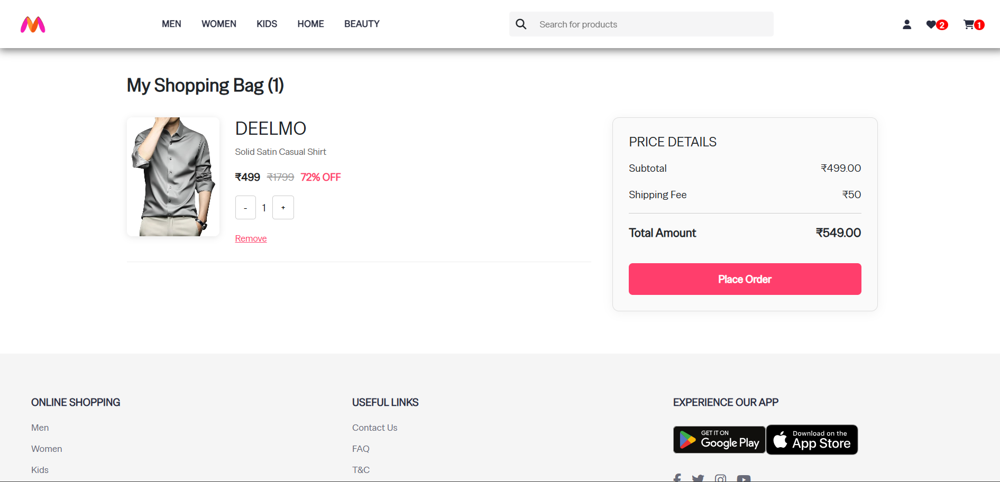
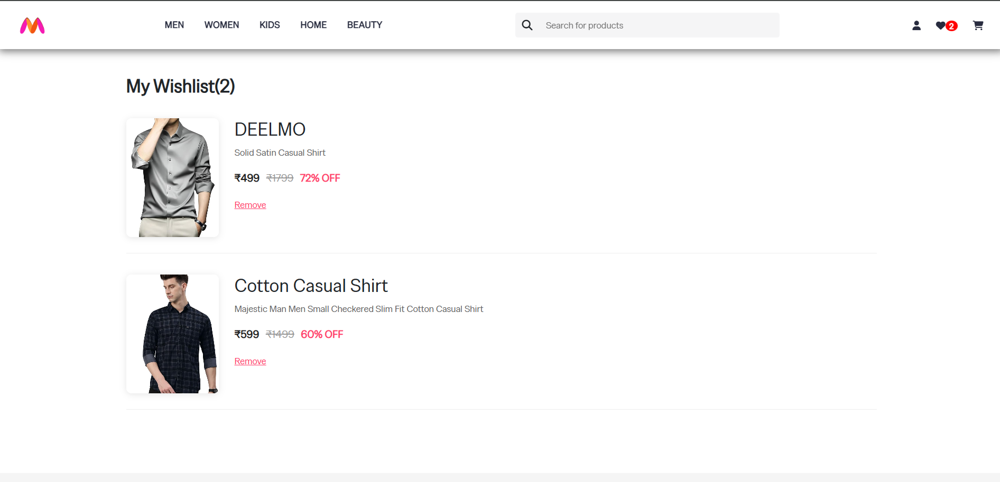
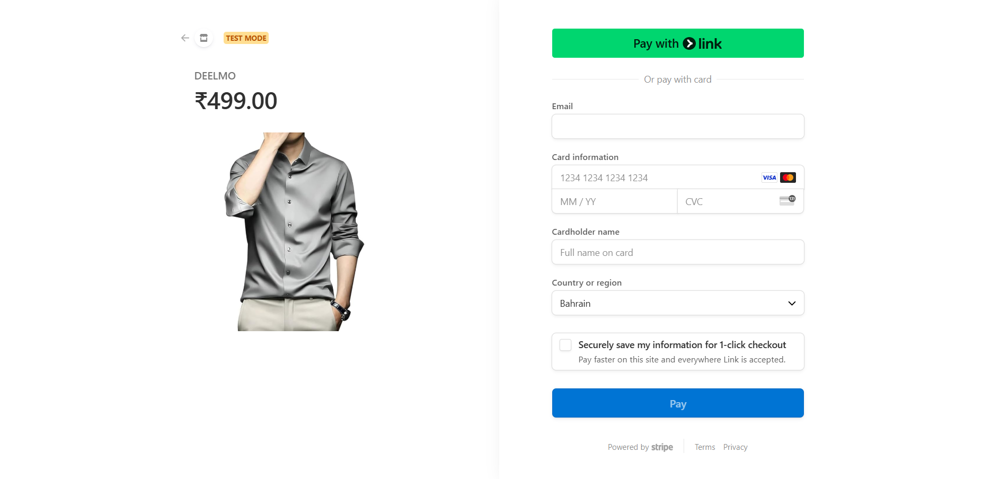

# 🛍️ Myntra Clone – Full Stack E-commerce Website

An elegant full-stack e-commerce application built using the **MERN stack (MongoDB, Express, React, Node.js)**. Users can browse products, add to cart, place orders, and manage their profiles. 

---

## 🚀 Live Demo

🔗 [Deployed Site](https://myntra-clone-cc8t.vercel.app/)  
🔗 [Github Repo](https://github.com/afham-haleema/MyntraClone)  

---

## 📸 Screenshots

 
 
 
 
 

---

## ✨ Features

- 🧾 User Registration & Login (JWT-based auth)
- 🛍️ Product browsing with size & quantity selection
- 🛒 Add to Cart, Edit, Remove Items
- ✅ Order placement with Stripe payment method
- 📦 Order History for each user
- 👤 User profile dashboard
- 📦 RESTful API with Express

---

## 🛠️ Tech Stack

**Frontend**  
- React.js  
- Axios  
- React Router  

**Backend**  
- Node.js  
- Express.js  
- MongoDB with Mongoose  
- JWT for authentication  

---

## 🧑‍💻 Author

**Afham Haleema**  
🔗 [LinkedIn](https://linkedin.com/in/afhamhaleema)  
📧 afhamhaleema@gmail.com  
🌐 [Portfolio](https://afham-haleema.github.io/Portfolio)